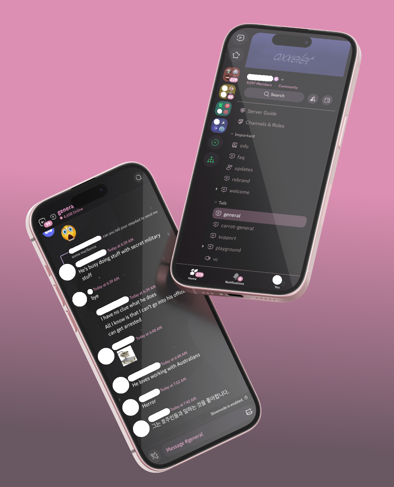

<h1 align="center">🌾 my discord stuff</h1>

  

 

<a href="https://github.com/ashish0kumar/windots/stargazers"><a>&nbsp;&nbsp;
&nbsp;&nbsp;
&nbsp;&nbsp;
&nbsp;&nbsp;

 <h2 id="about">🌷 About</h2>
 
Welcome, this repo includes my custom discord client, theme, fonts, and soon my fav plugins too.

## ✨ Features

- 🌸 Custom modded discord build
- 💫 Nice Discord theme 
- 🔤 Great fonts
- 🔌 Useful plugins 
- 🧹 Everything organized

## 🌸  Info

- **Modded Discord:** [Revenge](https://github.com/revenge-mod) (Android & iOS) 📱
- **Theme:** [PinkDiscord](https://raw.githubusercontent.com/axxelet/my-discord-stuff/refs/heads/main/assets/PinkDiscord) ✨
- **Font:** [Meloso](https://raw.githubusercontent.com/dora727/doraa-pyoncordstuff/refs/heads/master/Fonts/melosofont/meloso.json) ✨
- **Custom Icons:** [Themes+](https://bunny.nexpid.xyz/themes-plus/)
- **Extra:** [NexxUtils](https://bunny.nexpid.xyz/)

<h2 id="setup">🔧 Setup</h2>

### 💬 Custom Discord

- **Install** [**Revenge**](https://github.com/revenge-mod).

### 🎨 Discord Theme

- Copy the theme's link from **[here](https://raw.githubusercontent.com/axxelet/my-discord-stuff/refs/heads/main/assets/PinkDiscord)**
- Open Settings → themes
- Paste the link in there
- Enable it

### 🔡 Font

- Copy the link of [the font](https://raw.githubusercontent.com/dora727/doraa-pyoncordstuff/refs/heads/master/Fonts/melosofont/meloso.json)
- go to Settings > Fonts 
- paste the font link
- Hit apply / restart Revenge

 ### 🧩 Plugins

- Coming soon
- i’ll add my favorite ones here with install steps when ready

<h2 id="gallery">🖼️ ‎Gallery</h2>

| **Theme** |
|-------------------------------------------------------|
|  |

| **Font** |
|-------------------------------------------------------|
|  |

## 📌 TODO

- [ ] 🧩 Add **plugins** 

## 📜 License
Feel free to use and modify these to suit your needs.

## 💫 Star History

<a href="https://star-history.com/#ashish0kumar/windots&Date">
 <picture>
   <source media="(prefers-color-scheme: dark)" srcset="https://api.star-history.com/svg?repos=axxelet/my-discord-stuff=Date&theme=dark" />
   <source media="(prefers-color-scheme: light)" srcset="https://api.star-history.com/svg?repos=axxelet/my-discord-stuff&type=Date" />
   
 </picture>
</a>
